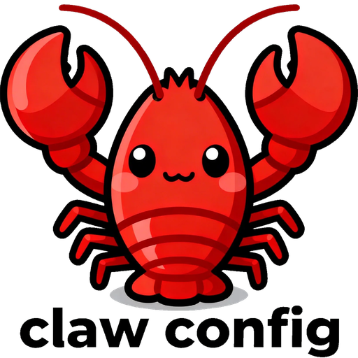

<div align="center">



# OpenClaw Config Manager

**Visual configuration management desktop app for the OpenClaw AI agent system**

**OpenClaw AI 智能体系统的可视化配置管理桌面应用**

[](LICENSE)
[](https://tauri.app)
[](https://react.dev)
[](https://www.typescriptlang.org)

[English](#english) · [中文](#中文)

</div>

---

<a name="english"></a>

## English

### Overview

OpenClaw Config Manager is a cross-platform desktop application built with [Tauri 2](https://tauri.app) + React 19 that provides a friendly GUI for managing the [OpenClaw](https://openclaw.ai) AI agent gateway — replacing manual edits to `~/.openclaw/openclaw.json` with a full-featured visual editor.

It connects to the running OpenClaw Gateway via WebSocket and offers real-time status monitoring, configuration editing, chat, scheduling, skills management, and multi-agent collaboration controls — all in a polished dark/light themed interface.

---

### ✨ Features

| Category | Features |
|---|---|
| **Gateway** | Real-time WebSocket connection · Port/auth/bind configuration · Tailscale tunnel · Auto-reconnect |
| **Agents** | Agent list CRUD · Model & system-prompt overrides · Heartbeat · A2A collaboration config · Sandbox |
| **Channels** | Feishu · Telegram · Discord · WhatsApp · Per-channel DM policy & allowlist |
| **Chat** | Real-time streaming chat · **Broadcast mode** (parallel message to N agents) · Thinking indicator |
| **Cron** | Cron-expression or interval scheduling · Job enable/disable · Delivery agent targeting |
| **Skills** | Installed skill browser · Extra skill directories · ClawHub marketplace search · API key management |
| **Tools** | Tool profile management · Browser/canvas/node/cron/webhook/skill registry |
| **Instances** | Manage multiple OpenClaw runtimes (local/remote/SSH tunnel) · One-click active instance switching |
| **Security** | Config security scan · Risk scoring · Intrusion-hardening recommendations |
| **Install Wizard** | OS-aware install guidance (Windows/macOS/Linux) · One-click copy commands · Post-install quick start |
| **Sessions** | Live session list · Message preview · Manual reset |
| **Usage** | Token & cost statistics · Model breakdown |
| **Raw Config** | Full JSON editor with live syntax highlighting (read/write `openclaw.json`) |
| **UI** | Dark / Light theme toggle · Simplified Chinese / English UI · i18n ready |

---

### 🖥️ Pages

| Page | Description |
|---|---|
| **Dashboard** | Gateway status, channel overview, quick-action shortcuts |
| **Gateway Settings** | Port, bind address, auth token, Tailscale, debounce & advanced options |
| **Agent Settings** | Multi-agent defaults, per-agent overrides, sandbox, heartbeat, A2A (Agent-to-Agent) |
| **Channel Settings** | Enable / configure Feishu, Telegram, Discord, WhatsApp |
| **Tools Settings** | Manage tool profiles: browser, canvas, node, cron, webhook, skill registry |
| **Skills** | Browse/install/remove skills; search ClawHub marketplace |
| **Cron Jobs** | Create & manage scheduled tasks with cron or interval triggers |
| **Chat** | Live chat with agents; broadcast mode dispatches to multiple agents in parallel |
| **Instances** | Add/edit/remove local + remote instances and switch active target quickly |
| **Security** | Run config security scans for auth/network/secrets/tls/access risks with remediation tips |
| **Install** | Detect current OS and show guided OpenClaw installation + verification steps |
| **Usage** | Token consumption and cost overview per model |
| **Sessions** | Active & historical session list with message preview |
| **Raw Config** | Low-level JSON editor for `openclaw.json` |

---

### 🏗️ Tech Stack

| Layer | Technology |
|---|---|
| Desktop shell | [Tauri 2](https://tauri.app) (Rust) |
| Frontend | [React 19](https://react.dev) + [TypeScript 5.8](https://www.typescriptlang.org) |
| Build tool | [Vite 7](https://vite.dev) |
| State management | [Zustand 5](https://zustand-demo.pmnd.rs) (with `persist`) |
| Styling | [Tailwind CSS 4](https://tailwindcss.com) + CSS custom properties |
| UI components | Custom component library (`src/components/ui/`) |
| Rust deps | `tauri 2`, `serde`, `serde_json`, `tauri-plugin-opener 2` |
| WebSocket | Native `WebSocket` API + custom `GatewayClient` |
| i18n | Static JSON bundles (`src/i18n/zh.ts`, `src/i18n/en.ts`) |

---

### 📋 Prerequisites

- **Node.js** 18+ (recommended: 20 LTS)
- **Rust** & Cargo (latest stable — install via [rustup](https://rustup.rs))
- **Tauri CLI** v2 (installed automatically by `npm install`)
- A running **OpenClaw Gateway** (default `ws://127.0.0.1:18789`)

> **Platform support:** Windows, macOS, Linux (all targets supported by Tauri 2)

---

### 🚀 Getting Started

#### 1. Clone & install dependencies

```bash
git clone <repo-url>
cd openclaw-config-manager
npm install
```

#### 2. Start in development mode

```bash
npm run tauri dev
```

This starts Vite's dev server and opens the Tauri window. Hot-module replacement is active for the React layer; Rust changes trigger a recompile.

#### 3. Build for production

```bash
npm run tauri build
```

Outputs a platform-native installer in `src-tauri/target/release/bundle/`.

#### 4. Frontend-only preview (no Tauri)

```bash
npm run dev       # Vite dev server at http://localhost:5173
npm run preview   # Preview production bundle
```

> ⚠️ Without Tauri, Rust IPC commands (`invoke`) are unavailable. Gateway WebSocket still works if the gateway is accessible.

---

### 📁 Project Structure

```
openclaw-config-manager/
├── src/                        # React frontend
│   ├── components/
│   │   └── ui/                 # Shared UI components
│   │       └── index.tsx       # PageHeader, SectionCard, FormField, Toggle,
│   │                           #   Badge, HelpTip, InfoBox, SaveBar, ConfirmModal …
│   ├── hooks/                  # Custom React hooks
│   ├── i18n/
│   │   ├── zh.ts               # Simplified Chinese strings
│   │   └── en.ts               # English strings
│   ├── pages/
│   │   ├── Dashboard.tsx
│   │   ├── GatewaySettings.tsx
│   │   ├── AgentSettings.tsx
│   │   ├── ChannelSettings.tsx
│   │   ├── ToolsSettings.tsx
│   │   ├── SkillsPage.tsx
│   │   ├── CronPage.tsx
│   │   ├── ChatPage.tsx
│   │   ├── InstancesPage.tsx
│   │   ├── SecurityPage.tsx
│   │   ├── InstallPage.tsx
│   │   ├── UsagePage.tsx
│   │   ├── SessionsPage.tsx
│   │   └── RawConfig.tsx
│   ├── services/
│   │   ├── gatewayWs.ts        # Singleton WebSocket client & RPC helpers
│   │   └── config.ts           # File-based config read/write via Tauri invoke
│   ├── store/
│   │   └── index.ts            # Zustand store: config, theme, language, WS state
│   ├── types/                  # TypeScript interfaces & enums
│   ├── App.tsx                 # Root component, sidebar navigation
│   └── index.css               # Global CSS: dark/light variables, card/blur styles
├── src-tauri/
│   ├── src/
│   │   ├── lib.rs              # Tauri commands: read/write config, cron, skills, HTTP
│   │   └── main.rs             # App entry point
│   ├── Cargo.toml
│   └── tauri.conf.json         # App name, window (1200×800), identifier
├── package.json
└── vite.config.ts
```

---

### ⚙️ Configuration

The app reads and writes `~/.openclaw/openclaw.json`. A backup (`openclaw.json.bak`) is created automatically before every write.

#### Connecting to the Gateway

On first launch (or after clearing settings) a connection banner appears. Enter:

| Field | Default | Description |
|---|---|---|
| Gateway URL | `ws://127.0.0.1:18789` | WebSocket URL of the running OpenClaw gateway |
| Auth token | _(empty)_ | Bearer token if auth is enabled on the gateway |

Settings are persisted with Zustand's `persist` middleware in `localStorage`.

#### Multi-instance switching

Use the **Instances** page to register local or remote OpenClaw gateways and switch the active instance. This is useful when you manage multiple environments (for example local dev + remote VM).

---

### 🌐 Internationalisation

The UI supports **Simplified Chinese** (`zh`) and **English** (`en`). Switch via the language toggle in the top bar. Adding a new language:

1. Duplicate `src/i18n/en.ts` → `src/i18n/<lang>.ts`
2. Translate all string values
3. Register the new locale in `src/store/index.ts` and `App.tsx`

---

### 🔌 WebSocket API

`services/gatewayWs.ts` provides a thin typed wrapper over `GatewayClient`:

```ts
// One-shot RPC
const config = await gwRpc.getConfig();

// Streaming (chat)
const unsub = gwRpc.chat(agentId, message, (chunk) => { /* ... */ });
unsub(); // stop listening

// Broadcast to multiple agents
await handleBroadcastSend(targets, message);
```

The client auto-reconnects with exponential back-off and emits connection-state events to the Zustand store.

---

### 🤝 Multi-Agent Collaboration (A2A)

The **Chat** page includes a **Broadcast Mode** that sends a single message in parallel to multiple agents and displays each response in a separate column:

1. Click **📡 广播** (Broadcast) in the sidebar header.
2. Select the desired agents (or use 全选 / 清空).
3. Type a message and press **Enter** — it is dispatched to all selected agents simultaneously.

**AgentSettings** exposes global and per-agent A2A controls:

- **A2A Enable** — allows agents to delegate sub-tasks to each other.
- **Loop Detection** — prevents infinite delegation chains (configurable `maxIterations`).
- **Group Chat Trigger Keywords** — comma-separated patterns that wake an agent in multi-agent conversations.

---

### 🔧 Tauri Commands (Rust)

| Command | Description |
|---|---|
| `get_config_path` | Returns absolute path of `~/.openclaw/openclaw.json` |
| `read_config_file(path)` | Reads a file and returns its content as a string |
| `write_config_file(path, content)` | Writes content to file (creates `.bak` backup first) |
| `read_cron_jobs(base_dir)` | Reads `<base>/.openclaw/cron/jobs.json` |
| `write_cron_jobs(base_dir, content)` | Writes cron jobs JSON (creates dir if missing) |
| `list_skills(base_dir)` | Lists installed skills (dirs with `SKILL.md`) |
| `get_openclaw_home` | Returns `~/.openclaw` path |
| `check_gateway_port(port)` | TCP probe — returns `true` if port is open |
| `read_text_file(path)` | Async read of any text file |
| `write_text_file(path, content)` | Async write of any text file (creates parent dirs) |
| `http_post_json(url, token, body)` | HTTP POST bypass (avoids CORS in WebView) |

---

### 🐛 Troubleshooting

| Problem | Solution |
|---|---|
| "Gateway not connected" on launch | Make sure OpenClaw Gateway is running: `openclaw gateway run` |
| Tauri command fails | Ensure Rust toolchain is installed: `rustup update stable` |
| Window is blank | Run `npm run dev` to check for frontend errors in browser console |
| Config changes not saved | Check file permissions on `~/.openclaw/openclaw.json` |
| Theme not switching | Clear `localStorage` and reload |

---

### 📄 License

MIT © OpenClaw Contributors

---

---

<a name="中文"></a>

## 中文

### 项目简介

OpenClaw Config Manager 是一款基于 [Tauri 2](https://tauri.app) + React 19 构建的跨平台桌面应用，为 [OpenClaw](https://openclaw.ai) AI 智能体网关提供友好的图形化配置管理界面。

它通过 WebSocket 实时连接到正在运行的 OpenClaw Gateway，提供实时状态监控、配置编辑、聊天对话、任务调度、技能管理以及多智能体协作控制——所有功能集成在一个精致的深色/浅色主题界面中，彻底替代手动编辑 `~/.openclaw/openclaw.json` 的繁琐方式。

---

### ✨ 功能特性

| 分类 | 功能 |
|---|---|
| **网关** | WebSocket 实时连接 · 端口/鉴权/绑定配置 · Tailscale 隧道 · 自动重连 |
| **智能体** | 智能体 CRUD · 模型与系统提示词覆盖 · 心跳检测 · A2A 协作配置 · 沙盒 |
| **渠道** | 飞书 · Telegram · Discord · WhatsApp · 每渠道 DM 策略与白名单 |
| **聊天** | 实时流式聊天 · **广播模式**（并行向 N 个智能体发消息）· 思考状态指示器 |
| **定时任务** | Cron 表达式或间隔模式 · 任务启用/禁用 · 目标智能体配置 |
| **技能** | 已安装技能浏览 · 额外技能目录 · ClawHub 市场搜索 · API 密钥管理 |
| **工具** | 工具档案管理（浏览器/画布/Node/Cron/Webhook/技能注册表）|
| **实例管理** | 管理多个 OpenClaw 运行实例（本地/远程/SSH 隧道）· 一键切换当前实例 |
| **安全分析** | 配置安全扫描 · 风险评分 · 入侵防护建议 |
| **安装向导** | 按操作系统提供安装引导（Windows/macOS/Linux）· 一键复制命令 · 安装后快速启动 |
| **会话** | 实时会话列表 · 消息预览 · 手动重置 |
| **用量** | Token 与费用统计 · 按模型分类 |
| **原始配置** | 全功能 JSON 编辑器（读写 `openclaw.json`）|
| **界面** | 深色/浅色主题切换 · 简体中文/英文 · 可扩展 i18n |

---

### 🖥️ 页面说明

| 页面 | 说明 |
|---|---|
| **仪表盘** | 网关状态、渠道概览、快捷操作入口 |
| **网关设置** | 端口、绑定地址、鉴权令牌、Tailscale、防抖与高级选项 |
| **智能体设置** | 多智能体全局默认值、单智能体覆盖、沙盒、心跳、A2A（智能体间委托）|
| **渠道设置** | 启用/配置飞书、Telegram、Discord、WhatsApp |
| **工具设置** | 管理工具档案：浏览器、画布、Node、Cron、Webhook、技能注册表 |
| **技能管理** | 浏览/安装/移除技能；搜索 ClawHub 市场 |
| **定时任务** | 创建和管理 Cron 或 Interval 触发的计划任务 |
| **聊天** | 实时聊天；广播模式可并行向多个智能体发送消息 |
| **实例管理** | 增删改本地/远程实例，并快速切换当前连接目标 |
| **安全分析** | 对认证/网络/密钥/TLS/访问控制进行配置安全扫描，并提供修复建议 |
| **安装向导** | 自动识别当前系统并给出 OpenClaw 安装与验证步骤 |
| **用量统计** | 按模型查看 Token 消耗与费用概览 |
| **会话管理** | 活跃和历史会话列表，支持消息预览 |
| **原始配置** | 低级 JSON 编辑器，直接读写 `openclaw.json` |

---

### 🏗️ 技术栈

| 层次 | 技术 |
|---|---|
| 桌面框架 | [Tauri 2](https://tauri.app)（Rust 后端）|
| 前端框架 | [React 19](https://react.dev) + [TypeScript 5.8](https://www.typescriptlang.org) |
| 构建工具 | [Vite 7](https://vite.dev) |
| 状态管理 | [Zustand 5](https://zustand-demo.pmnd.rs)（含 `persist` 中间件）|
| 样式方案 | [Tailwind CSS 4](https://tailwindcss.com) + CSS 自定义属性 |
| UI 组件库 | 内置组件库（`src/components/ui/`）|
| Rust 依赖 | `tauri 2`、`serde`、`serde_json`、`tauri-plugin-opener 2` |
| WebSocket | 原生 `WebSocket` API + 自定义 `GatewayClient` |
| 国际化 | 静态 JSON 字符串包（`src/i18n/zh.ts`、`src/i18n/en.ts`）|

---

### 📋 环境要求

- **Node.js** 18+（推荐 20 LTS）
- **Rust** 与 Cargo（最新稳定版——通过 [rustup](https://rustup.rs) 安装）
- **Tauri CLI** v2（执行 `npm install` 时自动安装）
- 已运行的 **OpenClaw Gateway**（默认地址 `ws://127.0.0.1:18789`）

> **平台支持：** Windows、macOS、Linux（Tauri 2 支持的全部目标平台）

---

### 🚀 快速开始

#### 1. 克隆仓库并安装依赖

```bash
git clone <repo-url>
cd openclaw-config-manager
npm install
```

#### 2. 启动开发模式

```bash
npm run tauri dev
```

此命令同时启动 Vite 开发服务器并打开 Tauri 窗口。React 层支持热模块替换（HMR）；修改 Rust 代码会自动触发重新编译。

#### 3. 构建生产版本

```bash
npm run tauri build
```

平台原生安装包将输出到 `src-tauri/target/release/bundle/` 目录。

#### 4. 仅前端预览（不含 Tauri）

```bash
npm run dev       # Vite 开发服务器，地址 http://localhost:5173
npm run preview   # 预览生产构建产物
```

> ⚠️ 脱离 Tauri 运行时，Rust IPC 命令（`invoke`）不可用；但只要网关可访问，WebSocket 连接仍然正常工作。

---

### 📁 项目结构

```
openclaw-config-manager/
├── src/                        # React 前端
│   ├── components/
│   │   └── ui/                 # 共享 UI 组件
│   │       └── index.tsx       # PageHeader、SectionCard、FormField、Toggle、
│   │                           #   Badge、HelpTip、InfoBox、SaveBar、ConfirmModal …
│   ├── hooks/                  # 自定义 React Hooks
│   ├── i18n/
│   │   ├── zh.ts               # 简体中文字符串
│   │   └── en.ts               # 英文字符串
│   ├── pages/
│   │   ├── Dashboard.tsx       # 仪表盘
│   │   ├── GatewaySettings.tsx # 网关设置
│   │   ├── AgentSettings.tsx   # 智能体设置
│   │   ├── ChannelSettings.tsx # 渠道设置
│   │   ├── ToolsSettings.tsx   # 工具设置
│   │   ├── SkillsPage.tsx      # 技能管理
│   │   ├── CronPage.tsx        # 定时任务
│   │   ├── ChatPage.tsx        # 聊天（含广播模式）
│   │   ├── InstancesPage.tsx   # 实例管理
│   │   ├── SecurityPage.tsx    # 安全扫描与入侵分析
│   │   ├── InstallPage.tsx     # 安装向导
│   │   ├── UsagePage.tsx       # 用量统计
│   │   ├── SessionsPage.tsx    # 会话管理
│   │   └── RawConfig.tsx       # 原始配置
│   ├── services/
│   │   ├── gatewayWs.ts        # 单例 WebSocket 客户端与 RPC 工具函数
│   │   └── config.ts           # 通过 Tauri invoke 读写配置文件
│   ├── store/
│   │   └── index.ts            # Zustand store：配置、主题、语言、WS 状态
│   ├── types/                  # TypeScript 接口与枚举
│   ├── App.tsx                 # 根组件，侧边栏导航
│   └── index.css               # 全局 CSS：深/浅色变量、卡片/磨砂玻璃样式
├── src-tauri/
│   ├── src/
│   │   ├── lib.rs              # Tauri 命令：读写配置、Cron、技能、HTTP
│   │   └── main.rs             # 应用入口
│   ├── Cargo.toml
│   └── tauri.conf.json         # 应用名称、窗口尺寸（1200×800）、标识符
├── package.json
└── vite.config.ts
```

---

### ⚙️ 配置说明

应用读取并写入 `~/.openclaw/openclaw.json`。每次写入前会自动创建备份 `openclaw.json.bak`。

#### 连接网关

首次启动（或清除设置后），顶部会显示连接提示。填写以下信息：

| 字段 | 默认值 | 说明 |
|---|---|---|
| 网关地址 | `ws://127.0.0.1:18789` | 正在运行的 OpenClaw Gateway 的 WebSocket 地址 |
| 鉴权令牌 | _（留空）_ | 若网关启用了鉴权，填写 Bearer Token |

配置通过 Zustand 的 `persist` 中间件持久化到 `localStorage`。

#### 多实例切换

可在**实例管理**页面登记本地或远程 OpenClaw 网关，并切换当前活跃实例。适用于同时管理多个环境（例如本地开发环境 + 远程服务器环境）。

---

### 🌐 国际化

界面支持**简体中文**（`zh`）和**英文**（`en`），可通过顶部栏的语言切换按钮实时切换。

如需新增语言：

1. 复制 `src/i18n/en.ts` 为 `src/i18n/<locale>.ts`
2. 翻译所有字符串值
3. 在 `src/store/index.ts` 和 `App.tsx` 中注册新语言

---

### 🔌 WebSocket API

`services/gatewayWs.ts` 在原生 `GatewayClient` 上提供了类型化的薄封装：

```ts
// 单次 RPC 调用
const config = await gwRpc.getConfig();

// 流式聊天
const unsub = gwRpc.chat(agentId, message, (chunk) => { /* 处理流式片段 */ });
unsub(); // 停止订阅

// 广播给多个智能体
await handleBroadcastSend(targets, message);
```

客户端内置指数退避自动重连，并将连接状态同步到 Zustand store。

---

### 🤝 多智能体协作（A2A）

**聊天**页面内置**广播模式**，可将单条消息并行发送到多个智能体，并在独立列中展示每个智能体的回复：

1. 点击侧边栏顶部的 **📡 广播** 按钮。
2. 勾选目标智能体（或使用**全选** / **清空**）。
3. 输入消息并按 **Enter** —— 消息将同时分发给所有选中的智能体。

**智能体设置**中提供全局和单智能体级别的 A2A 控制：

- **启用 A2A** —— 允许智能体将子任务委托给其他智能体执行。
- **循环检测** —— 防止无限委托链（可配置 `maxIterations` 最大迭代次数）。
- **群聊唤起关键词** —— 逗号分隔的触发词，在多智能体对话中唤醒指定智能体。

---

### 🔧 Tauri 命令（Rust）

| 命令 | 说明 |
|---|---|
| `get_config_path` | 返回 `~/.openclaw/openclaw.json` 的绝对路径 |
| `read_config_file(path)` | 读取文件并返回字符串内容 |
| `write_config_file(path, content)` | 写入文件（写前自动创建 `.bak` 备份）|
| `read_cron_jobs(base_dir)` | 读取 `<base>/.openclaw/cron/jobs.json` |
| `write_cron_jobs(base_dir, content)` | 写入 Cron 任务 JSON（目录不存在时自动创建）|
| `list_skills(base_dir)` | 列举已安装技能（含 `SKILL.md` 的目录）|
| `get_openclaw_home` | 返回 `~/.openclaw` 路径 |
| `check_gateway_port(port)` | TCP 探测——端口开放返回 `true` |
| `read_text_file(path)` | 异步读取任意文本文件 |
| `write_text_file(path, content)` | 异步写入任意文本文件（自动创建父目录）|
| `http_post_json(url, token, body)` | HTTP POST 代理（绕过 WebView 的 CORS 限制）|

---

### 🐛 常见问题

| 问题 | 解决方案 |
|---|---|
| 启动后显示"未连接网关" | 确保 OpenClaw Gateway 正在运行：`openclaw gateway run` |
| Tauri 命令执行失败 | 检查 Rust 工具链：`rustup update stable` |
| 窗口空白 | 运行 `npm run dev`，在浏览器控制台查看前端错误 |
| 配置修改后未保存 | 检查 `~/.openclaw/openclaw.json` 的文件读写权限 |
| 主题切换无效 | 清除 `localStorage` 后重新加载 |

---

### 📄 许可证

MIT © OpenClaw Contributors
